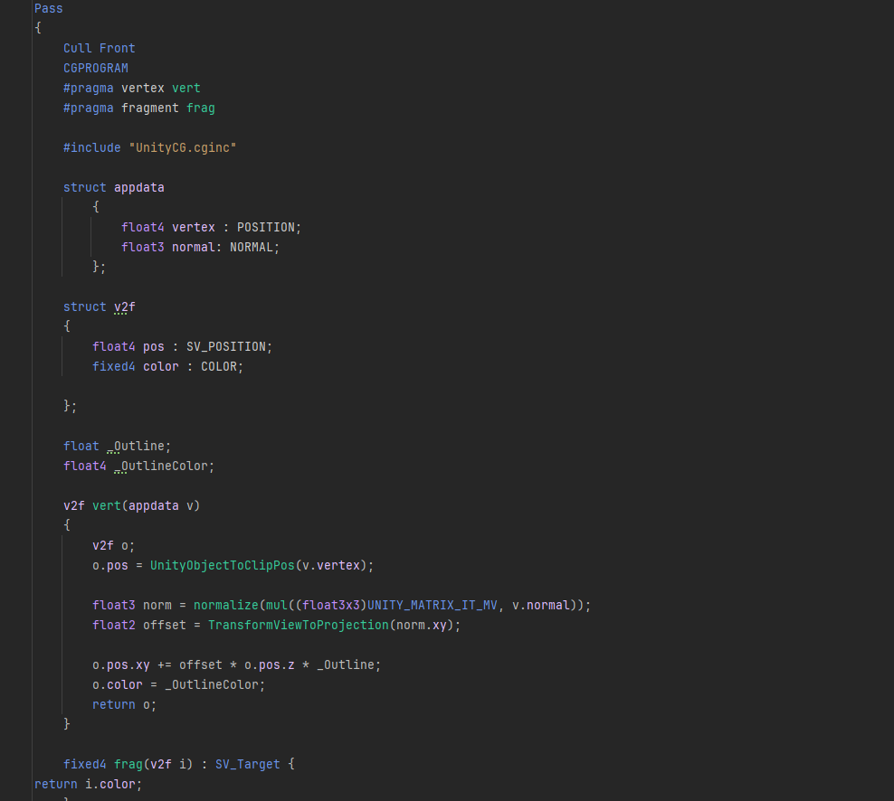

# CG-Review
Model Grabbed from Miximo, it is the mannequin model. 

# Toon-Outline Shader 
For our first shader we choose to make a toon-outline shader. By combining these two shaders we thought that we can have a stylized game reminiscent of the original.
We believe that the main audience of the Knock-Out franchise would value a more cartoonish game rather than going all out for a realistic looking game.
With this in mind, we applied a basic toon shader with elements of the advanced outline shader. 
Also being a game that is associated with Nintendo, we believe that is another reason why fans are expecting a cartoony game. 

How we implemented this shader is by splitting it into two main areas of the shader code. 

The first section is outlining our attributes of the shader which encompass both elements of the toon shader and the outline shader. 
We then started work with implementing the toon shader. This part of the code calculates the lighting and what areas are the highlights, midtones and the shadows. 
These areas will find the lights ray and adjust itself to where on the object will be most illuminated. That's where the highlight will appear.

The end of this portion of this shader is calling upon the color of the main shader and applying it to the toon ramp (provided by you).
Then there is the second pass of the shader which is the outline portion of the shader. I also added the color into the final output to allow for more use/customizability for the shader. 
For instance when a character gets mad, you can add a light red to it to create that light highlight of tomato red that cartoon characters usually look like while being mad. 
You can even apply a light green to make the character either look like a zombie or is very sick. 

This shader first takes in the current position of the vertex and the normals of the mesh and stores them in appdata. 
The shader then takes in the information of the color to take in consideration for the outline effect. 
The shader then takes in where the mesh's position is and where its normals actually are and normalizes everything. 
This is so that the outline will actually be applied outwards (when using a positive integer) and look like a general outline effect. 
The shader takes the normalized value (pointed outwards) and applies an offset value to create the width of the outline effect. 
The initial point of the outline is where the mesh is facing the world and the end of the outline effect is how large (or small) the offset value is.
This shader is essentially taking only the elements that are facing the world and generating a secondary mesh to create the outline effect. 
